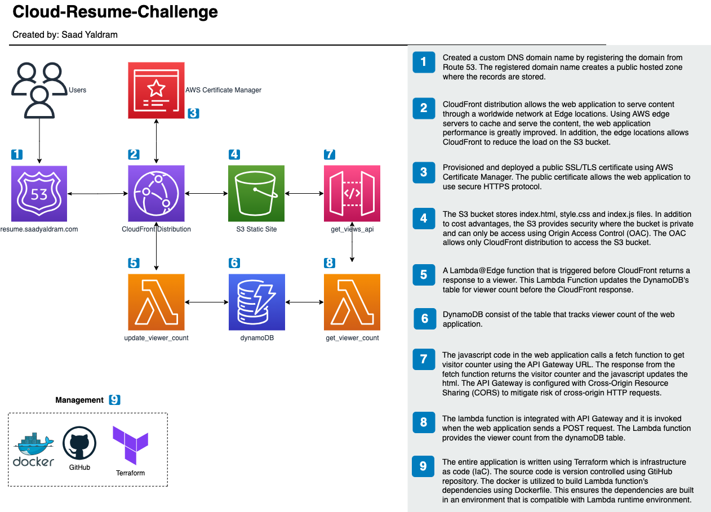

# cloud-resume-challenge

## Background
The AWS Cloud Resume Challenge is a project that builds a personal resume/portfolio website with a visitor counter, and deploy it fully through a number of AWS services. The project is inspired by :[https://cloudresumechallenge.dev/docs/the-challenge/aws/](https://cloudresumechallenge.dev/docs/the-challenge/aws/)

## Website
The personal portfolio website can be found here: [https://resume.saadyaldram.com](https://resume.saadyaldram.com)

## Diagram

## Frontend
The front end web application code can be found here in this GitHub repository: [https://github.com/syaldram/portfolio](https://github.com/syaldram/portfolio). The website was coded entirely from scratch and utilized many of the web dev frameworks in development today. 

## Backend
The backend is provisioned using infrastructure as code (IaC) Terraform. The Terraform code utilizes modules heavily to speed up the development time for the application. 

## CI/CD Frontend
The GitHub Actions enabled in this project creates a workflow that automatically builds and deploys the backend application whenever the code in the Terraform directory is pushed to repository.